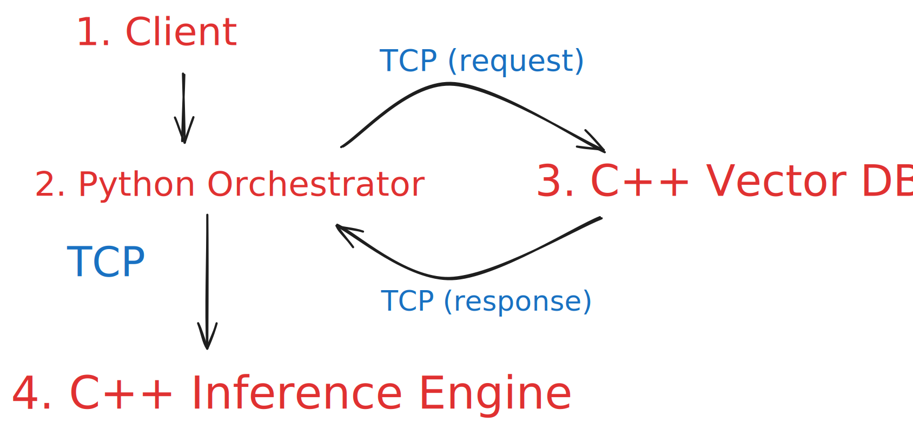

# NitroRAG
**A C++ Retrieval-Augmented Generation System from First Principles**

**Repository Goal:** NitroRAG is *not* intended to compete with production inference engines like vLLM or llama.cpp. The project focuses on understanding the systems techniques used in modern LLM infrastructure—such as memory paging, cache locality, and graph routing—by implementing them from first principles and measuring their behaviors under concurrent workloads.

---

## 🧭 Why I Built This

Modern LLM applications are composed of three major subsystems: retrieval, inference, and serving. Most educational projects focus on one of these independently (e.g., building a toy neural network or a basic vector search script). NitroRAG explores how these systems interact inside a unified architecture.

The goal was to study the interaction between retrieval, scheduling, memory management, and CPU execution under concurrent workloads. When integrated, specific hardware bottlenecks are exposed: cache inefficiencies during prefill, memory fragmentation under concurrent load, and graph routing degradation during multi-attribute searches.

---

## 🏗️ System Architecture
<p align="center">
  
</p>

## ✨ Feature Highlights

*   **Graph-based Vector Search:** Custom multi-attribute graph routing (JAG) for conjunctive filters.
*   **CPU Transformer Inference:** Int8 (Q8_0) quantized runtime with AVX2 SIMD kernels.
*   **Continuous Batching:** Iteration-level scheduling to maximize throughput.
*   **Paged Memory:** Non-contiguous 16-token memory blocks to reduce internal fragmentation.
*   **Prefix Caching:** Radix-style memory sharing via FNV-1a hashing.
*   **Distributed Serving:** Custom binary RPC protocol over POSIX TCP sockets.

---

## 🔄 Query Lifecycle

<p align="center">
  
</p>

1. **Client Gateway:** Python parses natural language into structured intents and embeds the query.
2. **Retriever:** C++ Vector DB traverses the Joint Attribute Graph to find context.
3. **Prompt Assembly:** Gateway concatenates retrieved document tokens with the user's prompt.
4. **Prefix Cache:** Inference Engine hashes the prompt to locate shared memory blocks in $O(1)$ time.
5. **Prefill / PagedAttention:** Engine computes missing tokens and allocates physical memory pages.
6. **Continuous Scheduler:** Request is injected into the active batch for decoding.
7. **Decode & Response:** Tokens are generated via AVX2 kernels and streamed over TCP back to the user.

---

## 🛤️ The Design Journey

This architecture evolved iteratively by evaluating hardware bottlenecks:

*   **Version 1: Static Allocation** $\rightarrow$ Allocated contiguous KV-cache arrays up to `max_seq_len`.
    *   *Observation:* Severe internal fragmentation. OOM crashed at 20 concurrent users.
*   **Version 2: Paged Memory** $\rightarrow$ Implemented 16-token virtual pages.
    *   *Observation:* Eliminated OOM crashes, but single-thread compute dropped due to pointer-chasing and L1 cache misses.
*   **Version 3: AVX2 & Prefix Caching** $\rightarrow$ Switched to AVX2 Int8 block-wise math and FNV-1a hashing.
    *   *Observation:* Recouped compute speed and reduced shared-prompt latency significantly.
*   **Version 4: Continuous Batching** $\rightarrow$ Implemented iteration-level scheduling.
    *   *Observation:* Minimized padding overhead, increasing aggregate decode throughput for concurrent users.

---

## 📊 Performance Highlights

**Benchmark Environment**

- **CPU:** Intel Core i5-13420H (4 Performance Cores + 4 Efficiency Cores, 12 Threads)
- **Memory:** 16 GB DDR5 RAM
- **Compiler:** GCC 13.3.0
- **Compiler Flags:** `-O3 -march=native -ffast-math -fopenmp`
- **Model:** Llama-2 110M (INT8 Q8_0)
- **Dataset:** SIFT1M (1,000,000 vectors)


| Metric | Result Observed |
| :--- | :--- |
| **Recall@10 (Mixed Filter)** | 99.9% (at 0.1% query selectivity) |
| **Max Concurrent Users Tested** | 50 |
| **Peak Memory Reduction** | 98.9% vs. Baseline (14.4 GB $\to$ 146 MB) |
| **Shared-Prefix TTFT** | < 1 ms (Cache Hit) |

👉 **For complete benchmarking methodology, flamegraphs, ablation studies, and engineering trade-offs, please see [ARCHITECTURE.md](docs/ARCHITECTURE.md).**

---

## 🗺️ Repository Map

- `README.md` — *Executive Summary (You are here).*
- `docs/ARCHITECTURE.md` — *Deep dive into subsystems, benchmarks, trade-offs, and lessons learned.*
- `src/` — *C++ source code (VectorDB, Inference Engine, Memory Manager).*
- `scripts/` — *Python quantization and API gateway scripts.*

---

## 🚀 Quick Start

**Prerequisites:** GCC with AVX2 and OpenMP support, Python 3.10+.

```bash
# 1. Compile the microservices
g++ -O3 -march=native -ffast-math -fopenmp src/Server_VectorDB.cpp -o vector_db
g++ -O3 -march=native -ffast-math -fopenmp src/Server_Inference.cpp -o engine

# 2. Quantize model weights (FP32 -> Int8)
python scripts/quantize_bin.py

# 3. Boot the backend
./vector_db & 
./engine &

# 4. Start the client
python scripts/agent.py
```

---

## ⚠️ Known Limitations

*   **CPU-Only:** Optimized strictly for x86 CPUs. No CUDA/GPU backend.
*   **Model Support:** Hardcoded for Llama-2/3 style decoder-only architectures.
*   **Static Graph:** The Vector DB does not support real-time streaming insertions/deletions.
*   **Quantization:** Uses simple Block-Wise Q8_0 quantization. Does not support advanced methods like AWQ/GPTQ.
*   **Single Node:** Services run locally; no RDMA or distributed multi-node clustering implemented.

## 🔮 Future Work

*   **Anisotropic Quantization:** Integrating ScaNN-style anisotropic vector quantization to minimize recall degradation while enabling higher compression ratios for billion-scale vector indices.
*   **Pre-Retrieval Query Expansion (HyDE):** Routing queries through a lightweight draft model for intent restructuring prior to embedding generation.
*   **Speculative Decoding:** Implementing a draft-model continuous batching loop to accelerate single-user token generation.
*   **Streaming Vamana:** Supporting online vector insertions and deletions through incremental graph maintenance, eliminating the need for complete index reconstruction after dataset updates.
 
## 📚 References

*   [llama2.c](https://github.com/karpathy/llama2.c) (Andrej Karpathy)
*   [vLLM: Easy, Fast, and Cheap LLM Serving with PagedAttention](https://arxiv.org/abs/2309.06180) (Kwon et al., 2023)
*   [JAG: Joint Attribute Graphs for Filtered Nearest Neighbor Search](https://arxiv.org/abs/2402.10258) (Xu et al., 2024)
*   [DiskANN: Fast Accurate Billion-point Nearest Neighbor Search](https://arxiv.org/abs/1912.01623) (Subramanya et al., 2019)

